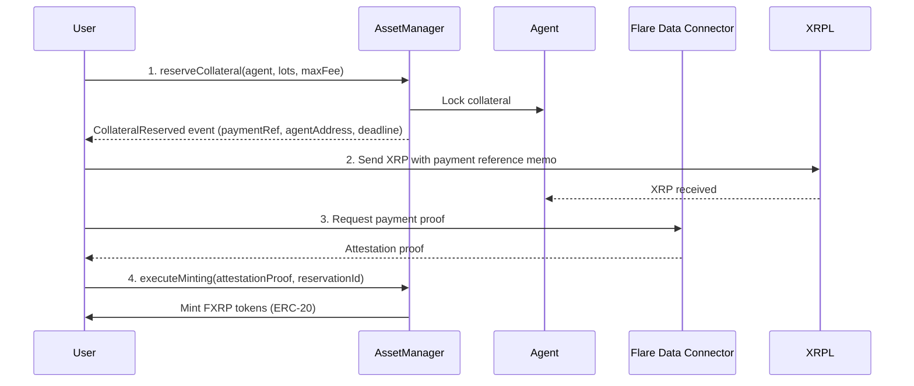

# Flare FAssets Integration Guide

**Last Updated:** November 11, 2025  
**FAssets Version:** v1.2 (Mainnet - September 2025)

## Overview

FAssets is Flare Network's trustless, over-collateralized bridge connecting non-smart contract chains (XRP, BTC, DOGE) to Flare's DeFi ecosystem. FXRP (wrapped XRP) was the first FAsset to launch on mainnet.

**Key Features:**
- 1:1 XRP backing with overcollateralization
- Trustless bridging powered by Flare Data Connector (FDC)
- ERC-20 compatible on Flare Network
- Full redemption capability at any time
- Audited by Zellic, Coinspect, Code4rena

---

## Contract Addresses

### Flare Mainnet (Chain ID: 14)

| Contract | Address | Notes |
|----------|---------|-------|
| **FXRP Token** | `0xAf7278D382323A865734f93B687b300005B8b60E` | ✅ Verified on Flarescan |
| **Flare Contract Registry** | `0xaD67FE66660Fb8dFE9d6b1b4240d8650e30F6019` | Query for AssetManager address |
| **AssetManager** | *Retrieved via Registry* | Use `getContractAddressByName("AssetManager")` |

**Alternative FXRP Address:** `0xAd552A648C74D49E10027AB8a618A3ad4901c5bE` (verify on Flarescan)

**Block Explorer:** https://flarescan.com  
**RPC Endpoint:** https://flare-api.flare.network/ext/C/rpc

### Coston2 Testnet (Chain ID: 114)

| Contract | Address | Notes |
|----------|---------|-------|
| **FXRP Token** | `0xa3Bd00D652D0f28D2417339322A51d4Fbe2B22D3` | ✅ Confirmed |
| **Flare Contract Registry** | `0xaD67FE66660Fb8dFE9d6b1b4240d8650e30F6019` | Same address across networks |
| **AssetManager** | *Retrieved via Registry* | Dynamic retrieval required |

**Block Explorer:** https://coston2-explorer.flare.network  
**RPC Endpoint:** https://coston2-api.flare.network/ext/C/rpc

### Retrieving AssetManager Address

FAssets uses a dynamic contract registry system. **Never hardcode AssetManager addresses.**

```typescript
import { ethers } from 'ethers';

const REGISTRY_ADDRESS = "0xaD67FE66660Fb8dFE9d6b1b4240d8650e30F6019";
const REGISTRY_ABI = [
  "function getContractAddressByName(string calldata) external view returns (address)"
];

const provider = new ethers.JsonRpcProvider("https://flare-api.flare.network/ext/C/rpc");
const registry = new ethers.Contract(REGISTRY_ADDRESS, REGISTRY_ABI, provider);

// Get AssetManager address
const assetManagerAddress = await registry.getContractAddressByName("AssetManager");
console.log("AssetManager:", assetManagerAddress);
```

---

## Minting Resources

### Official Minting dApps

- **AU Platform:** https://fassets.au.cc/mint
- **Oracle Daemon:** https://fasset.oracle-daemon.com/flare

### Supported Wallets

| Wallet | Flare Support | XRPL Support | Notes |
|--------|--------------|--------------|-------|
| **Bifrost** | ✅ | ✅ | Best for full minting flow |
| **Ledger** | ✅ | ✅ | Hardware wallet |
| **Luminite** | ✅ | ✅ | Integrated FAssets support |
| **MetaMask** | ✅ | ❌ | Flare-side only |
| **Xaman** | ❌ | ✅ | XRPL-side only |

---

## FAssets Minting Flow

### Step-by-Step Process



### 1. Reserve Collateral

```typescript
import { IAssetManager } from "@flarelabs/fasset/contracts/userInterfaces/IAssetManager.sol";

// Connect to AssetManager
const assetManager = new ethers.Contract(assetManagerAddress, IAssetManager.abi, signer);

// Reserve collateral with agent
const tx = await assetManager.reserveCollateral(
  agentVaultAddress,        // Selected agent
  lotsToMint,               // Amount in lots (e.g., 1 lot = 1 XRP)
  maxMintingFeeBIPS,        // Max fee in basis points (e.g., 250 = 2.5%)
  ethers.ZeroAddress,       // Executor address (or ZeroAddress)
  { value: collateralReservationFee }
);

// Parse the CollateralReserved event
const receipt = await tx.wait();
const event = receipt.logs.find(log => log.topics[0] === CollateralReservedEventTopic);
const { 
  collateralReservationId,
  agentAddress,       // XRPL address to send XRP to
  amountUBA,         // Amount to pay in underlying asset (XRP drops)
  paymentReference,  // 32-byte hex to include in XRPL memo
  lastUnderlyingBlock,
  lastUnderlyingTimestamp
} = parseEvent(event);
```

### 2. Send XRP Payment

Send XRP to the agent's XRPL address with the payment reference as a memo:

```typescript
import { Client, Payment } from 'xrpl';

const client = new Client('wss://xrplcluster.com');
await client.connect();

const payment: Payment = {
  TransactionType: 'Payment',
  Account: userXrplAddress,
  Destination: agentAddress,
  Amount: amountUBA.toString(), // XRP in drops
  Memos: [{
    Memo: {
      MemoData: Buffer.from(paymentReference, 'hex').toString('hex'),
      MemoType: Buffer.from('fassets-payment', 'utf8').toString('hex')
    }
  }]
};

const prepared = await client.autofill(payment);
const signed = wallet.sign(prepared);
const result = await client.submitAndWait(signed.tx_blob);
```

### 3. Obtain Payment Proof (FDC)

Wait for XRPL transaction finality (~7 blocks), then obtain attestation proof from Flare Data Connector.

**Finality Requirements:**
- **XRPL:** 7 blocks (~30-40 seconds)
- **Bitcoin:** 6 blocks (~60 minutes)
- **Dogecoin:** 60 blocks (~60 minutes)

### 4. Execute Minting

```typescript
// Get attestation proof from FDC
const attestationProof = await getFdcProof(xrplTxHash);

// Execute minting
const mintTx = await assetManager.executeMinting(
  attestationProof,
  collateralReservationId
);

await mintTx.wait();
// FXRP tokens are now minted to your Flare address!
```

---

## FAssets Redemption Flow

### Redeem FXRP for XRP

```typescript
// Approve FXRP spending
const fxrpToken = new ethers.Contract(fxrpAddress, ERC20_ABI, signer);
await fxrpToken.approve(assetManagerAddress, amountToRedeem);

// Initiate redemption
const redeemTx = await assetManager.redeem(
  lotsToRedeem,              // Amount in lots
  userXrplAddress,           // Your XRPL address to receive XRP
  ethers.ZeroAddress         // Executor (or ZeroAddress)
);

const receipt = await redeemTx.wait();
// RedemptionRequested event emitted

// Agent has 24 hours to send XRP to your XRPL address
// FXRP is burned immediately
```

**Redemption Timeline:**
- FXRP burned immediately upon request
- Agent must send XRP within 24 hours
- If agent fails, collateral is released to you as compensation

---

## Key Events

### CollateralReserved Event

```solidity
event CollateralReserved(
    address indexed minter,
    uint256 indexed collateralReservationId,
    address indexed agentVault,
    uint256 amountUBA,
    uint256 feeUBA,
    uint256 firstUnderlyingBlock,
    uint256 lastUnderlyingBlock,
    uint256 lastUnderlyingTimestamp,
    bytes32 paymentReference
);
```

### MintingExecuted Event

```solidity
event MintingExecuted(
    address indexed minter,
    uint256 indexed collateralReservationId,
    uint256 amountUBA,
    uint256 agentFeeUBA,
    uint256 poolFeeUBA
);
```

### RedemptionRequested Event

```solidity
event RedemptionRequested(
    address indexed redeemer,
    uint256 indexed requestId,
    address indexed agentVault,
    uint256 amountUBA,
    uint256 feeUBA,
    string paymentAddress
);
```

---

## Fees & Economics

### Minting Fees

| Fee Type | Charged In | Amount | Purpose |
|----------|-----------|--------|---------|
| **Collateral Reservation Fee (CRF)** | FLR | Governance-set % | Compensates agent for locked collateral time |
| **Minting Fee** | XRP | Agent-set % | Main revenue for agent & collateral pool |
| **Executor Fee** | FLR | Optional | Incentivizes bot execution |

**Typical Fees:**
- Collateral Reservation Fee: ~0.1-0.5% of minted value (in FLR)
- Minting Fee: 0.25-1% (agent-specific, paid in XRP)

### Redemption Fees

- **Redemption Fee:** 0.1-0.5% (agent-specific, paid from XRP sent back)

---

## Collateralization

### Collateral Types

Agents must maintain collateral in two forms:

1. **Vault Collateral** (140% minimum):
   - USDC, USDT, ETH, or other approved stablecoins
   
2. **Pool Collateral** (Community-provided):
   - Native tokens (FLR on Flare, SGB on Songbird)

**Example:** To mint 100 FXRP (~$50 value):
- Agent needs ~$70 in USDC + pool collateral
- Total backing: 200%+ including pool

### Collateral Ratios

- **Minimum CR:** 140% (vault) + pool collateral
- **Safe CR:** 160%+
- **Liquidation:** Triggered if CR drops below minimum
- **Full Liquidation:** If agent violates protocol rules

---

## Gas Requirements

### Flare Network Gas Costs

**Mainnet Estimates:**
- Reserve Collateral: ~200,000 gas (~0.02 FLR)
- Execute Minting: ~300,000 gas (~0.03 FLR)
- Redeem: ~250,000 gas (~0.025 FLR)

**Gas Price:** Typically 25 gwei on Flare mainnet

### XRPL Transaction Costs

- Base transaction fee: 0.00001 XRP (10 drops)
- Negligible compared to Flare gas costs

---

## Bridging Timeframes

### Minting (XRP → FXRP)

1. **Reserve Collateral:** Instant (Flare block time: ~2 seconds)
2. **Send XRP Payment:** 3-5 seconds (XRPL)
3. **Wait for Finality:** ~30-40 seconds (7 XRPL blocks)
4. **FDC Attestation:** ~1-2 minutes (proof generation + verification)
5. **Execute Minting:** ~2-5 seconds (Flare block)

**Total Time:** ~2-5 minutes

### Redemption (FXRP → XRP)

1. **Redeem Request:** Instant (FXRP burned)
2. **Agent Sends XRP:** Up to 24 hours (typically <1 hour)
3. **XRP Received:** 3-5 seconds after agent sends

**Total Time:** Minutes to 24 hours (depends on agent responsiveness)

---

## Core Vault System

### What is Core Vault?

The **Core Vault (CV)** is a multisig XRPL account managed by Flare governance that holds XRP backing without requiring agent collateral.

**Benefits:**
- Agents can deposit XRP to CV and free up collateral
- Increased capital efficiency for agents
- Improved redemption liquidity
- Multisig security on XRPL side

**Core Vault Address (XRPL):** Governed multisig (check official docs for current address)

---

## Integration Best Practices

### 1. Always Use Contract Registry

```typescript
// ✅ GOOD: Dynamic retrieval
const assetManager = await getAssetManagerFromRegistry();

// ❌ BAD: Hardcoded address
const assetManager = "0x123..."; // Will break if upgraded
```

### 2. Handle Payment Reference Carefully

The 32-byte payment reference MUST be included in XRPL memo exactly as provided by `CollateralReserved` event.

```typescript
// Store payment reference from event
const paymentRef = event.args.paymentReference;

// Include in XRPL memo as hex
Memos: [{
  Memo: {
    MemoData: paymentRef // Already in hex format
  }
}]
```

### 3. Wait for XRPL Finality

Do not request FDC proof until XRPL transaction has 7+ confirmations.

```typescript
// Wait for finality
const finalizedTx = await client.request({
  command: 'tx',
  transaction: txHash,
  min_ledger: currentLedger + 7
});
```

### 4. Monitor Events

Listen for minting/redemption events to track status:

```typescript
assetManager.on("MintingExecuted", (minter, reservationId, amount) => {
  console.log(`Minting complete! Amount: ${amount}`);
});

assetManager.on("RedemptionPerformed", (redeemer, requestId, amount) => {
  console.log(`XRP sent! Check XRPL for receipt.`);
});
```

---

## Error Handling

### Common Failure Scenarios

| Error | Cause | Solution |
|-------|-------|----------|
| `InsufficientCollateral` | Agent doesn't have enough free collateral | Choose different agent or wait |
| `PaymentTimeout` | XRP payment not made within deadline | Request will expire; retry minting |
| `InvalidPaymentReference` | Wrong memo in XRPL tx | Double-check payment reference from event |
| `ProofTooEarly` | Requested FDC proof before finality | Wait for 7+ XRPL confirmations |

### Handling Failed Minting

If you fail to send XRP within the deadline:
- Collateral reservation expires
- Collateral Reservation Fee is lost
- No FXRP minted
- You can start over with new reservation

---

## Official Resources

- **Developer Hub:** https://dev.flare.network/fassets/overview
- **Minting Guide:** https://dev.flare.network/fassets/developer-guides/fassets-mint
- **Redemption Guide:** https://dev.flare.network/fassets/developer-guides/fassets-redeem
- **GitHub Repository:** https://github.com/flare-foundation/fassets
- **Audits:** https://code4rena.com/audits/2025-08-flare-fasset

---

## Security Considerations

### Audits

- **Zellic:** Comprehensive smart contract audit (2024)
- **Coinspect:** Security review and audit (2024)
- **Code4rena:** Community audit competition (2025)
- **Hypernative:** 24/7 monitoring

### Risk Factors

1. **Agent Counterparty Risk:** Mitigated by overcollateralization
2. **XRPL Bridge Risk:** Mitigated by FDC cryptographic proofs
3. **Price Oracle Risk:** FTSO provides decentralized price feeds
4. **Smart Contract Risk:** Audited, but bugs always possible

### Bug Bounty

Active bug bounty program via **Immunefi** for responsible disclosure.

---

## Next Steps

1. ✅ Review contract addresses and verify on block explorer
2. ✅ Test minting flow on Coston2 testnet first
3. ✅ Integrate AssetManager ABI from official repository
4. ✅ Implement FDC proof retrieval (or use minting dApp APIs)
5. ✅ Add event listeners for mint/redeem tracking
6. ✅ Handle edge cases (timeouts, insufficient collateral)

**For Your Project:**
- Integrate FXRP deposits into your shXRP vault
- Accept FXRP as collateral for XRP-backed positions
- Use FAssets bridge to enable XRP holders to access Flare DeFi
